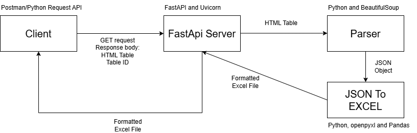

# HTML Table to Excel Converter

A FastAPI-based web service that converts HTML tables into formatted Excel spreadsheets with intelligent parsing and formatting preservation for financial tables.

## Features

- **Intelligent Table Parsing**
  - Handles complex table structures with `colspan` and `rowspan` attributes
  - Automatically detects header rows based on background colors or content
  - Preserves cell indentation and hierarchical structure
  - Handles multi-level headers with rowspan insertions

- **Smart Number Formatting**
  - Automatically detects and formats numbers
  - Preserves original formatting (commas, dollar signs, percentages)
  - Maintains decimal precision
  - Converts text numbers to actual Excel numbers for calculations

- **Hyperlink Support**
  - Extracts and preserves hyperlinks from HTML `<a>` tags
  - Supports external and relative URLs
  - Optional header hyperlink for table source attribution

- **Clean Excel Formatting**
  - Bold header row with centered text
  - Optional alternating row colors (white/gray)
  - Auto-adjusted column widths
  - Proper cell alignment (center-continuous for single-column rows)
  - Preserved text indentation for hierarchical data
  - Hidden gridlines for cleaner appearance





## Installation

### Prerequisites

- Python 3.7+
- pip

### Setup

1. Clone the repository:
```bash
git clone https://github.com/yourusername/html-to-excel.git
cd html-to-excel
```

2. Install dependencies:
```bash
pip install -r requirements.txt
```

### Requirements
```
fastapi
uvicorn
openpyxl
pandas
beautifulsoup4
starlette
```

## Usage

### Running the Server

Start the FastAPI server:
```bash
uvicorn api_calls:app --reload
```

The server will run at `http://[your local host]:8000`

### API Endpoints

#### GET `/convert-table-to-excel`

Convert an HTML table to an Excel file.

**Request Body:**
```json
{
    "html": "<table>...</table>",
    "table_id": "financial_table",
    "hyperlink": "https://example.com/source",
    "alternate_colors": true
}
```

**Parameters:**
- `html` (string, required): HTML table as a string
- `table_id` (string, required): Name for the output Excel file
- `hyperlink` (string, optional): URL to link in the first cell
- `alternate_colors` (boolean, optional): Enable alternating row colors (default: false)

**Response:**
- Excel file download (`.xlsx`)


#### GET `/health`

Health check endpoint.

**Response:**
```json
{
    "status": "healthy"
}
```

## Project Structure
```
html-to-excel/
├── api_calls.py          # FastAPI server and endpoints
├── table_parser.py       # HTML parsing and Excel generation logic
└── README.md            # This file
```

## How It Works

### 1. HTML Parsing (`parse_html_table`)

- Detects table structure using BeautifulSoup
- Handles rowspan cells by inserting them into subsequent rows
- Identifies header row based on:
  - Background color detection
  - First non-empty cell in first column (fallback)
- Builds column boundaries based on header colspans
- Extracts hyperlinks from `<a>` tags
- Detects indentation from CSS padding values
- Identifies single-column rows for center-continuous formatting

### 2. Excel Generation (`json_to_excel`)

- Converts parsed data to pandas DataFrame
- Applies number formatting:
  - Detects numbers by removing formatting characters
  - Preserves original formatting (commas, decimals, symbols)
  - Converts to Excel number format for calculations
- Applies hyperlinks to cells
- Formats with:
  - Bold header row
  - Optional alternating colors
  - Cell indentation
  - Center-continuous alignment
  - Auto-adjusted column widths

## Supported HTML Table Features

- ✅ `colspan` - Column spanning
- ✅ `rowspan` - Row spanning (from row 1 to row 2)
- ✅ Nested `<span>` tags
- ✅ Inline styles (background-color, padding, text-align)
- ✅ Hyperlinks (`<a href>`)
- ✅ Multi-level headers
- ✅ Empty/spacer rows
- ✅ Complex hierarchical structures

## Number Formatting Examples

| Input | Output Format | Excel Display |
|-------|--------------|---------------|
| `"2025"` | `0` | 2025 |
| `"62,647"` | `#,##0` | 62,647 |
| `"$1,234.56"` | `$#,##0.00` | $1,234.56 |
| `"12.5%"` | `0.0%` | 12.5% |
| `"99.99"` | `0.00` | 99.99 |


## Error Handling

The API returns appropriate HTTP status codes:

- `200 OK` - Successful conversion
- `400 Bad Request` - Invalid HTML or parsing error
- `422 Unprocessable Entity` - Invalid request body format

Error responses include a `detail` field with the error message:
```json
{
    "detail": "No table found in HTML"
}
```


Built with:
- [FastAPI](https://fastapi.tiangolo.com/) - Modern web framework
- [BeautifulSoup4](https://www.crummy.com/software/BeautifulSoup/) - HTML parsing
- [openpyxl](https://openpyxl.readthedocs.io/) - Excel file creation
- [pandas](https://pandas.pydata.org/) - Data manipulation
